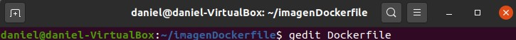
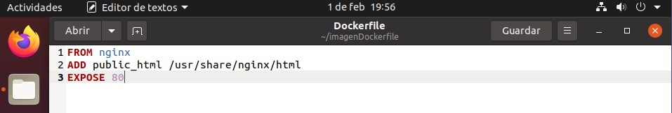
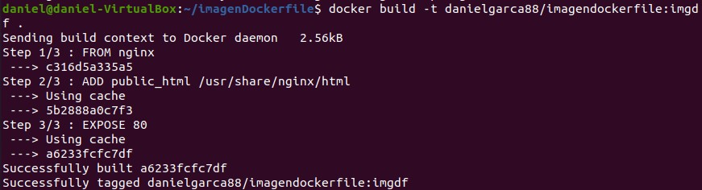
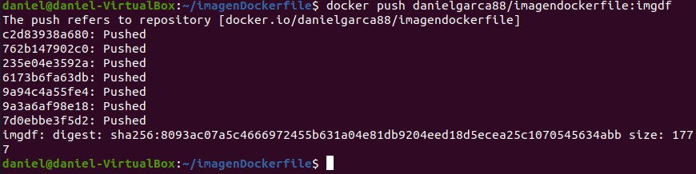
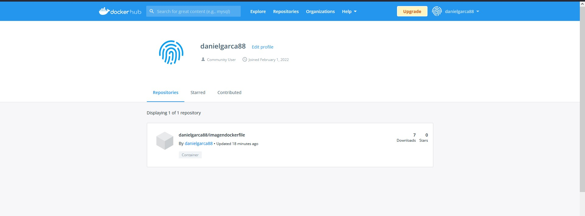
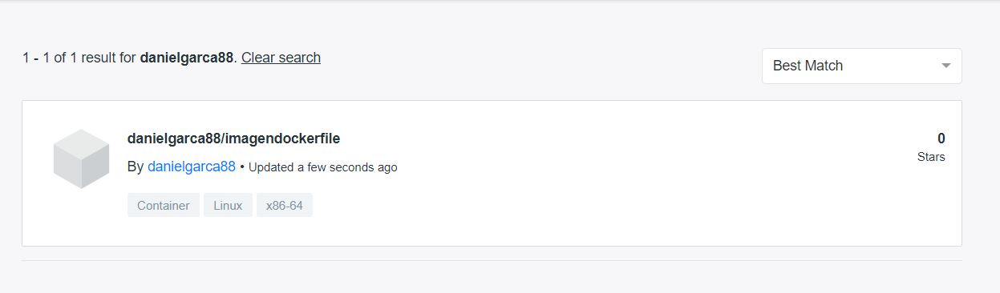
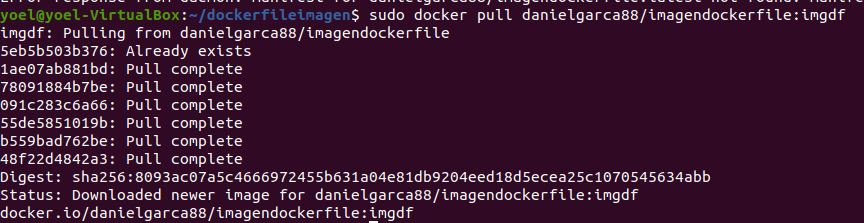
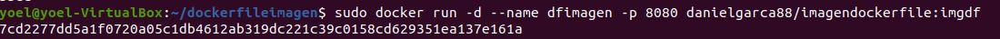

@title Imagen creada con Dockerfile
@author Yoel Fernández Suárez y Daniel García Castro

# 		Imagen creada con Dockerfile

[TOC]

### Apartado 1:

Pantallazo/bloque de código con el Dockerfile

### Apartado 2:

Pantallazo donde se vea el comando que crea la nueva imagen.

### Apartado 3:

Pantallazo donde se vea la imagen subida a tu cuenta de Docker Hub.

### Apartado 4:

 Pantallazo donde se vea la bajada de la imagen - por parte de otra persona del grupo - y la creación de un contenedor.

### Apartado 5:

Pantallazo donde se ve el acceso al navegador con el sitio servido

