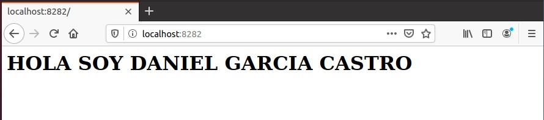

---
@auth
or Yoel Fernández Suárez y Daniel García Castro
---

# 			EJERCICIO ALMACENAMIENTO

[TOC]


#### Apartado 1:

Una vez hecho esto arrancar dos contenedores basados en la imagen php:7.4- apache que hagan un bind mount de la carpeta saludo en la carpeta /var/www/html del contenedor. Uno de ellos vamos a acceder con el puerto 8181 y el otro con el 8282. Y su nombres serán c1 y c2 .

```bash
sudo docker run -d --name c1 -v~/saludo:/var/www/html -p 8181:80 php:7.4-apache
```


.jpg)




#### Apartado 2:

Modifica el contenido del fichero ~/saludo/index.html .


#### Apartado 3:

Borra los contenedores

```bash
sudo docker stop c1
sudo docker stop c2
sudo docker rm c1
sudoo docker rm c2
```


