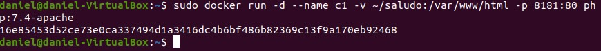
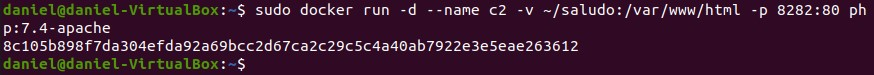
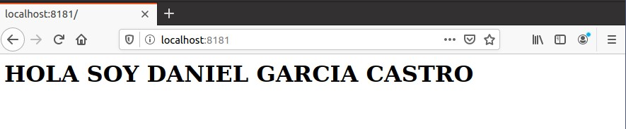
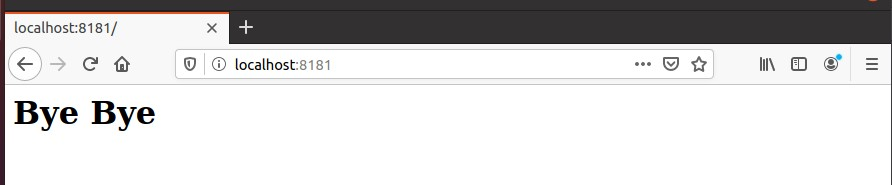
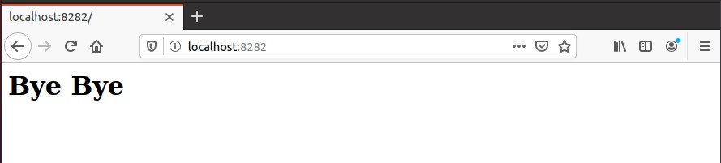
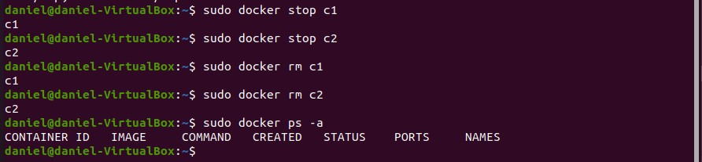

# 			Ejercicio Almancenamiento. Bind Mount para Compartir Datos

[TOC]

## Apartado 1.

Pantallazo con la orden correspondiente para arrancar el contenedor c1 (puerto 8181) realizando el bind mount solicitado:

```bash
sudo docker run -d --name c1 -v~/saludo:/var/www/html -p 8181:80 php:7.4-apache
```



## Apartado 2.

Pantallazo con la orden correspondiente para arrancar el contenedor c2 (puerto 8282) realizando el bind mount solicitado:

```bash
sudo docker run -d --name c2 -v~/saludo:/var/www/html -p 8282:80 php:7.4-apache
```



## Apartado 3.

Pantallazo donde se pueda apreciar que accediendo a c1 se puede ver el contenido de 'index.html':



## Apartado 4.

Pantallazo donde se pueda apreciar que accediendo a c2 se puede ver el contenido de 'index.html':


## Apartado 5.

Otros dos pantallazos donde se vea el acceso al fichero index.html después de modificarlo:






## Apartado 6.

Borrar los dos contenedores. Mostrar que se han borrado:

```bash
sudo docker stop c1
sudo docker stop c2
sudo docker rm c1
sudoo docker rm c2
sudo docker ps -a
```


