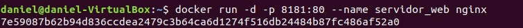
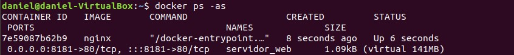
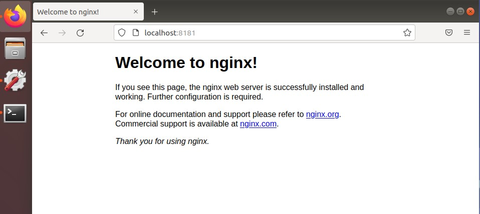
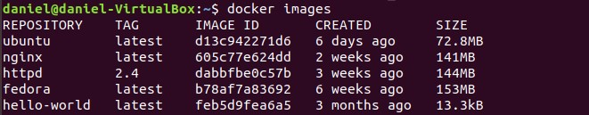
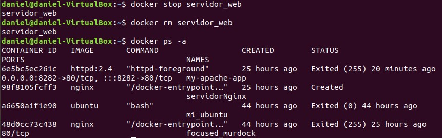

#                     EJERCICIO INICIAL

[TOC]

## Apartado 1.

Pantallazo donde se vea la creación del contenedor y podamos comprobar que el contenedor está funcionando:

```bash
docker run -d -p 8181:80 --name servidor_web nginx
docker ps -as
```





## Apartado 2.

Pantallazo donde se vea el acceso al servidor web utilizando un navegador web (recuerda que tienes que acceder a la ip del ordenador donde tengas instalado docker):



## Apartado 3.

Pantallazo donde se vean las imágenes que tienes en tu registro local:

```bash
docker images
```



## Apartado 4.

Pantallazo donde se vea cómo se elimina el contenedor (recuerda que antes debe estar parado el contenedor):

```bash
docker stop servidor_web
docker rm servidor_web
docker ps -a
```

