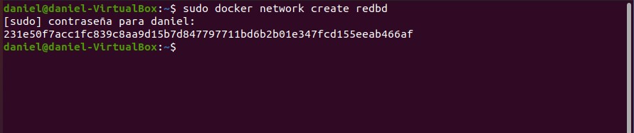
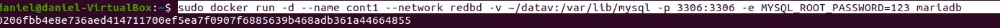
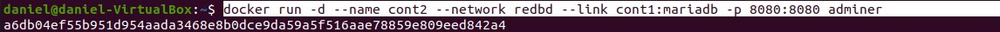
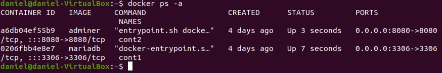
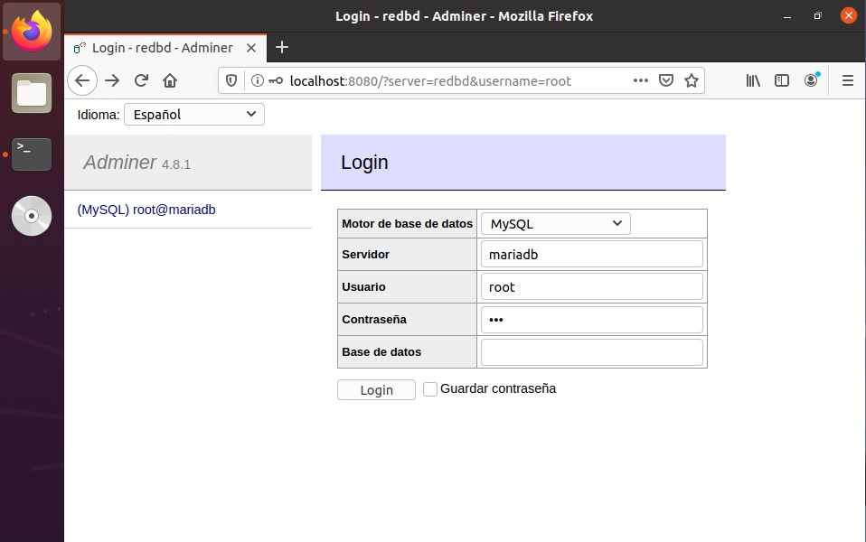
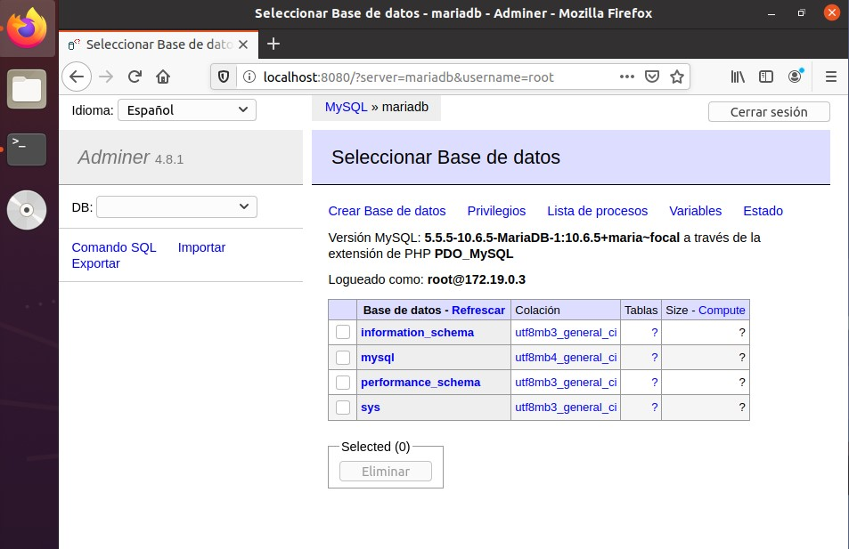
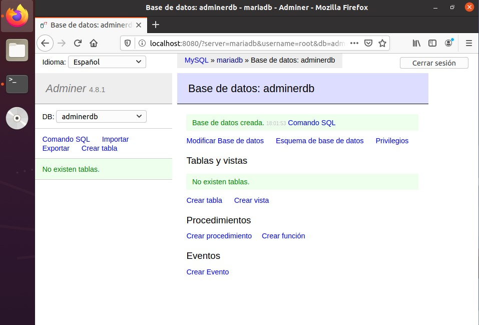
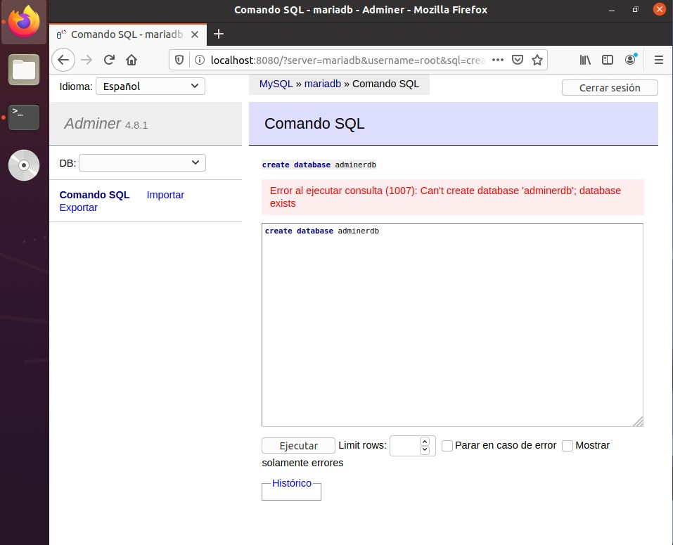
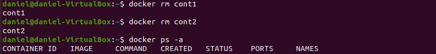
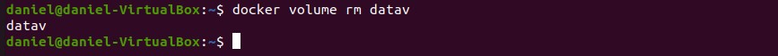

#  							

# 									Ejercicio Redes. Despliegue de contenedores en red: Adminer y MariaDB.

[TOC]

## Apartado 1.

Pantallazos donde se vean los contenedores creados y en ejecución:

```bash
sudo docker network create redbd
```




```bash
sudo docker run -d --name cont1 --network redbd -v ~/datav:var/lib/mysql -p 3336:3336 -e MYSQL_ROOT_PASSWORD=123 mariadb
```




```bash
sudo docker run -d --name cont2 --network redbd --link cont1:mariadb -p 8080:8080 adminer
```




```bash
docker ps -a
```



## Apartado 2.

 Pantallazo donde se vea el acceso a la BD a través de la interfaz web de Adminer:






## Apartado 3.

Pantallazo donde se vea la creación de una BD con la interfaz web Adminer:



## Apartado 4.

Pantallazo donde se entre a la consola del servidor web en modo texto y se
compruebe que se ha creado la BD:

```sql
create database adminerdb
```



## Apartado 5.

Borrar los contenedores la red y los volúmenes utilizados:

```bash
docker rm cont1
docker rm cont2
docker ps -a
```




```bash
docker volume rm datav
```

