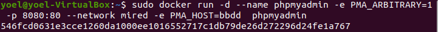
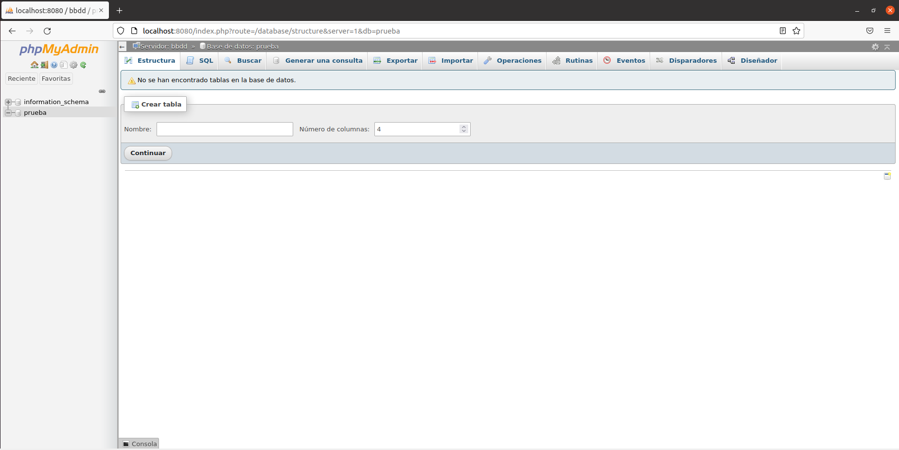
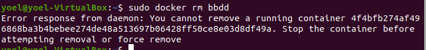

---
@author Yoel Fernández Suárez y Daniel García Castro
---

# 				


# 					Servidor de base de datos

[TOC]


#### Apartado 1:

Arrancar un contenedor que se llame bbdd y que ejecute una instancia de la imagen mariadb para que sea accesible desde el puerto 3336.

```bash
sudo docker run --detach --network mired --name bbdd --env MARIADB_USER=invitado --env MARIADB_PASSWORD=invitado --env MARIADB_PASSWORD=invitado --env MARIADB_ROOT_PASSWORD=root --env MARIADB_DATABASE=prueba -p 3336:3336 mariadb:latest
```


#### Captura 1:

Para conectar el phpmyadmin con mariadb:

```bash
sudo docker run -d --name phpmyadmin -e PMA_ARBITRARY=1 -p 8080:80 --network mired -e PMA_HOST=bbdd phpmyadmin
```



#### Resultado:



#### Captura 2:

Comprobar que no se puede eliminar el contenedor creado:

