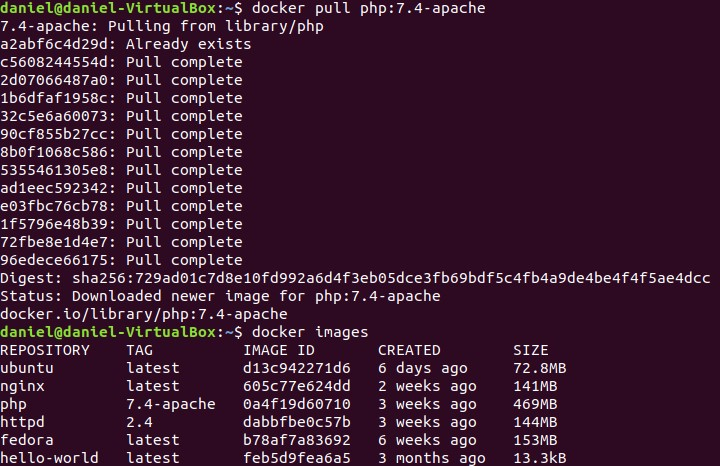
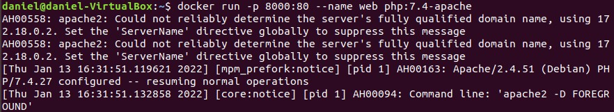
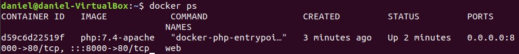
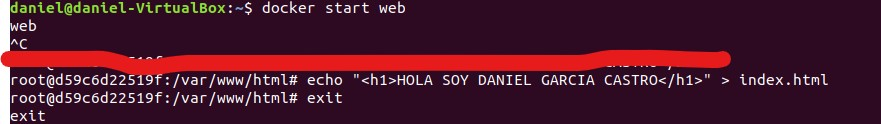
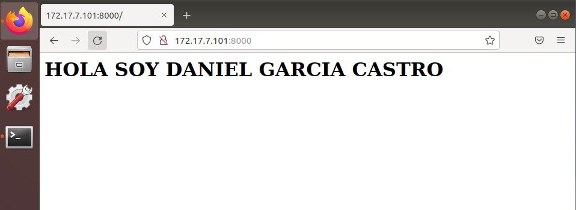
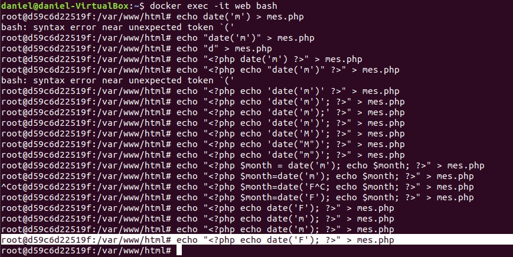
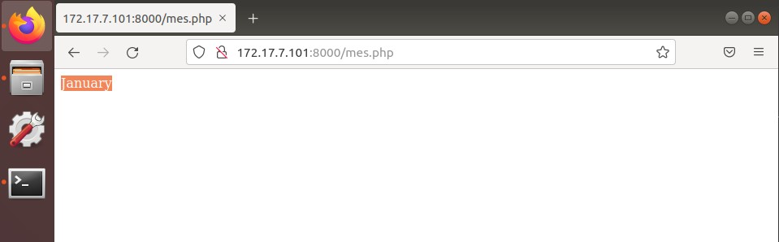
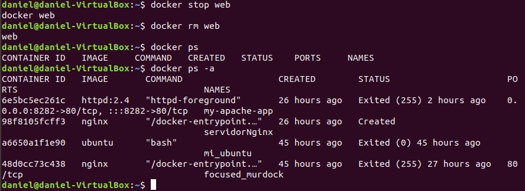

# 				Trabajo con imágenes

[TOC]


### Servidor Web:


#### Apartado 1:

Arranca un contenedor que ejecute una instancia de la imagen php:7.4-apache , que se llame web y que sea accesible desde un navegador en el puerto 8000.

```bash
docker pull php:7.4-apache
docker images
docker run -p 8000:80 --name web
```


```bash

```







#### APARTADO 2:

Colocar en el directorio raíz del servicio web ( /var/www/html ) de dicho contenedor un fichero llamado index.html con el siguiente contenido:

```bash
docker start web
echo"<h1>HOLA SOY DANIEL GARCIA CASTRO</h1>"
exit

```






#### APARTADO 3:

Colocar en ese mismo directorio raíz un archivo llamado mes.php que muestre el nombre del mes actual. Ver la salida del script en el navegador

```bash
docker exec -it web bash
echo "<?php echo date('F'); ?>" > mes.php
```





#### APARTADO 4:

```bash
docker stop web
docker rm web

```


