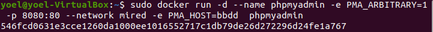

# 					Trabajo con imágenes. Servidor de Base de Datos

[TOC]

## Apartado 1.


Pantallazo que desde el navegador muestre el fichero 'index.html'


```bash
docker run -p 8000:80 --name web php:7.4-apache
docker start web
docker exec -it web bash
echo "<h1>Hola Soy DANIEL GARCIA CASTRO</h1>" > index.html
exit
```


## Apartado 2.

Pantallazo que desde un navegador muestre la salida del script 'mes.php':

```bash
docker exec -it web bash
echo "<?php echo date('F'); ?>" > mes.php
```


## Apartado 3.

Pantallazo donde se vea el tamaño del contenedor web después de crear los dos ficheros:


## Apartado 4.

Pantallazo donde desde un cliente de base de datos (instalado en tu ordenador) se pueda observar que hemos podido conectarnos al servidor de base de datos con el usuario creado y que se ha creado la base de datos prueba '(show databases)'. El acceso se debe realizar desde el ordenador que tenéis instalado docker, no hay que acceder desde dentro del contenedor, es decir, no usar 'docker exec':

```bash
sudo docker run --detach --network mired --name bbdd --env MARIADB_USER=invitado --env MARIADB_PASSWORD=invitado --env MARIADB_PASSWORD=invitado --env MARIADB_ROOT_PASSWORD=root --env MARIADB_DATABASE=prueba -p 3336:3336 mariadb:latest
```

Para conectar el contenedor con la imagen phpmyadmin al contenedor con la imagen de mariadb

```bash
sudo docker run -d --name phpmyadmin -e PMA_ARBITRARY=1 -p 8080:80 --network mired -e PMA_HOST=bbdd phpmyadmin
```





## Apartado 5.

Comprobar que no se puede eliminar el contenedor creado:

```bash
sudo docker rm bbdd
```


>>>
